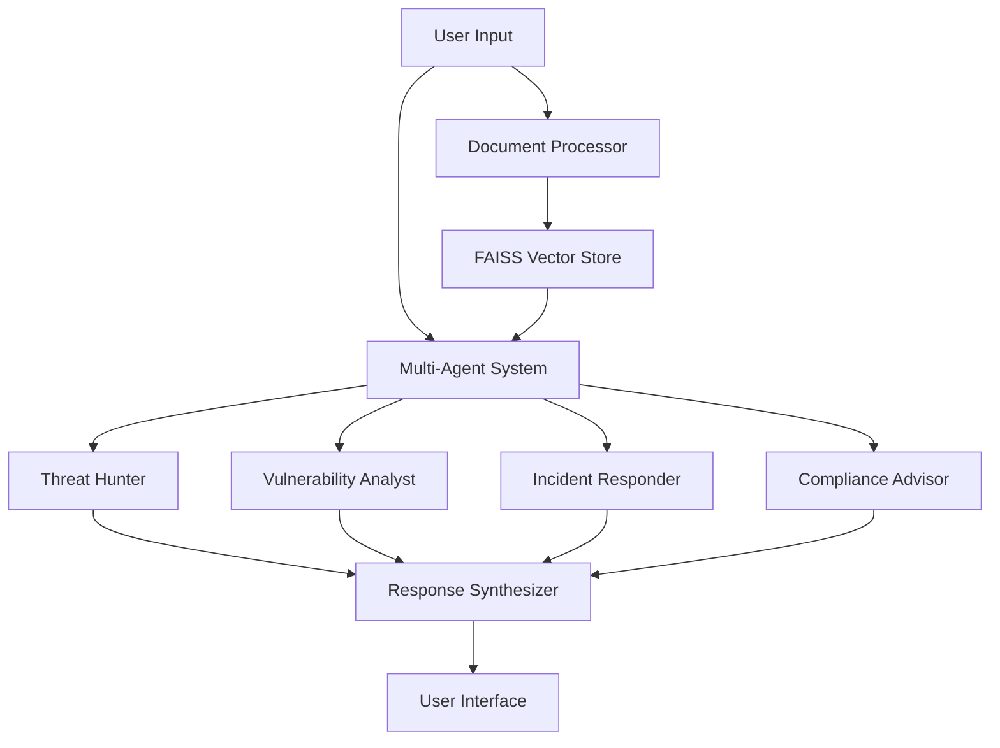

# 🤖 Cyber-BoT: Your AI Security Sidekick 🛡️

[](https://opensource.org/licenses/MIT)
[](https://www.python.org/downloads/)
[](https://streamlit.io/)

> *"In the digital realm where threats lurk in shadows, Cyber-BoT stands as your vigilant guardian, powered by AI wizardry! ✨"*

## 🌟 What is this Sorcery?

Cyber-BoT is not your average security tool - it's an AI-powered cybersecurity expert system that combines the powers of:
- 🕵️‍♂️ Threat Hunting
- 🎯 Vulnerability Analysis
- 🚨 Incident Response
- 📜 Compliance Advisory

All wrapped up in a sleek, Streamlit-powered interface that would make Tony Stark jealous! 

## 🚀 Features That Will Blow Your Mind

### 🤹 Multi-Agent Symphony
- 🔍 **Threat Hunter**: Sniffs out dangers like a cybersecurity bloodhound
- 🎯 **Vulnerability Analyst**: Finds weaknesses faster than you can say "penetration testing"
- ⚡ **Incident Responder**: Moves at the speed of light when things go south
- 📋 **Compliance Advisor**: Keeps you legal and looking good

### 🎭 Document Analysis Powers
- 📄 PDF Processing
- 🖼️ Image Analysis
- 🔮 Advanced OCR Magic

### 🧠 AI-Powered Features
- 🤖 FAISS Vector Search
- 🎯 Precision Embeddings
- 🌐 Context-Aware Responses

## 🏃‍♂️ Quick Start (For the Impatient)

```bash
# Clone this bad boy
git clone https://github.com/yourusername/Cyber-BoT.git

# Enter the matrix
cd Cyber-BoT

# Install the enchantments
pip install -r requirements.txt

# Launch the cyber guardian
streamlit run app.py
```

## 🎮 Usage (Even a Script Kiddie Could Do It)

1. 📁 Upload your security documents
2. 🚀 Hit that "Analyze" button
3. 💬 Ask your security questions
4. 🎉 Watch the magic happen!

## 🏗️ Architecture (For the Nerds)



## 🎨 Environment Setup (The Boring But Important Stuff)

```env
GROQ_API_KEY=your_groq_api_key
GOOGLE_API_KEY=your_google_api_key
```

## 🎯 Prerequisites

- Python 3.9+
- Tesseract OCR
- A sense of humor
- Coffee (lots of it) ☕

## 🤝 Contributing

Got ideas? Found a bug? Want to make Cyber-BoT even more awesome?

1. 🍴 Fork it
2. 🔧 Make it better
3. 🎉 Send a PR
4. 🌟 Get famous!

## 🎭 License

MIT License (Because sharing is caring! 💝)

```
Copyright (c) 2024 Cyber-BoT

Permission is hereby granted, free of charge, to any person obtaining a copy
of this software and associated documentation files (the "Software"), to deal
in the Software without restriction, including without limitation the rights
to use, copy, modify, merge, publish, distribute, sublicense, and/or sell
copies of the Software, and to permit persons to whom the Software is
furnished to do so, subject to the following conditions:

The above copyright notice and this permission notice shall be included in all
copies or substantial portions of the Software.

THE SOFTWARE IS PROVIDED "AS IS", WITHOUT WARRANTY OF ANY KIND, EXPRESS OR
IMPLIED, INCLUDING BUT NOT LIMITED TO THE WARRANTIES OF MERCHANTABILITY,
FITNESS FOR A PARTICULAR PURPOSE AND NONINFRINGEMENT. IN NO EVENT SHALL THE
AUTHORS OR COPYRIGHT HOLDERS BE LIABLE FOR ANY CLAIM, DAMAGES OR OTHER
LIABILITY, WHETHER IN AN ACTION OF CONTRACT, TORT OR OTHERWISE, ARISING FROM,
OUT OF OR IN CONNECTION WITH THE SOFTWARE OR THE USE OR OTHER DEALINGS IN THE
SOFTWARE.
```

## 🎉 Acknowledgments

- 🚀 The Streamlit team for making UI development fun again
- ☕ Coffee makers worldwide for keeping developers awake
- 🐛 Bugs for keeping us humble
- 🌙 Late nights for the best debugging sessions

## 📞 Support

Found a bug? Need help? Just want to chat?
- 📧 Open an issue
- 🌟 Star the repo
- 🍕 Send pizza

Remember: In cybersecurity, as in life, the best defense is a good AI! 🛡️

---

<div align="center">
Made with 💝 and ☕ by your friendly neighborhood security nerds
</div>
